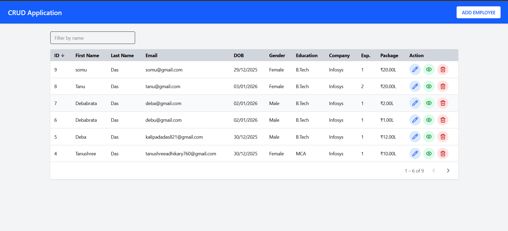
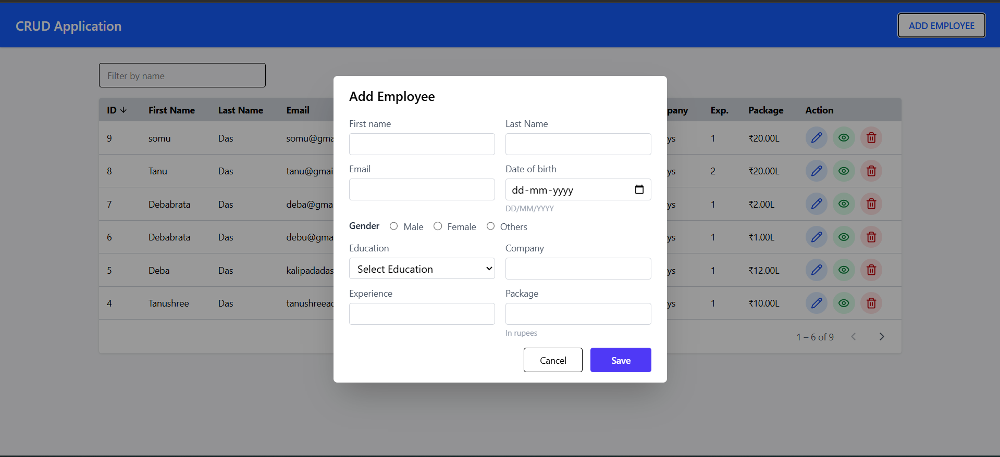
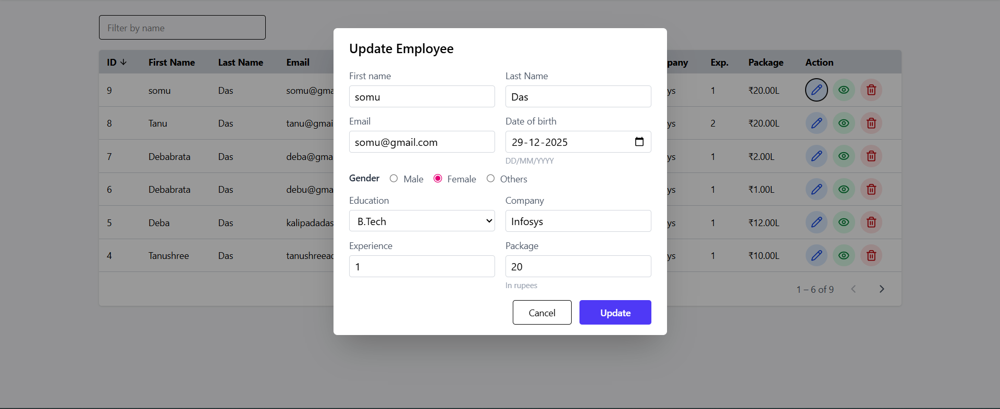
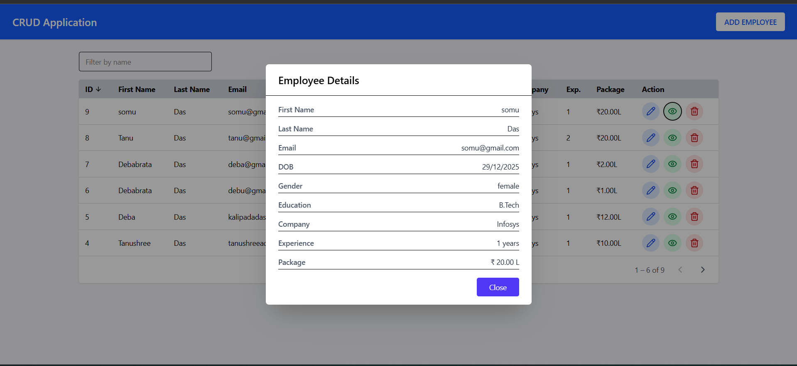

# CRUD MERN Application

A full-stack **MERN CRUD application** built with **React, Node.js, Express, MongoDB**, and deployed using **Vercel (Frontend + Backend)**.

---

## 📸 Screenshots

### Home Page



### Add Employee Page



### Edit Page



### Review Page



---

## 🚀 Features

- Create, Read, Update, Delete (CRUD) Employees
- RESTful API with Express & MongoDB
- React frontend with Axios
- CORS-enabled backend
- Serverless-compatible backend for Vercel
- Environment-based configuration

---

## 🛠 Tech Stack

### Frontend

- React (Vite)
- Axios
- Tailwind CSS (optional)

### Backend

- Node.js
- Express.js
- MongoDB (Mongoose)
- CORS
- dotenv

### Deployment

- **Frontend**: Vercel
- **Backend**: Vercel Serverless Functions
- **Database**: MongoDB Atlas

---

## 📁 Project Structure

```txt
backend/
├── server.js
├── vercel.json
├── package.json
├── config/
│   └── db.js
├── models/
│   └── employee.model.js
├── routes/
│   └── employee.routes.js
├── controllers/
│   └── employee.controller.js

frontend/
├── src/
│   ├── lib/
│   │   └── axios.js
│   ├── api/
│   │   └── employee.api.js
│   └── components/
└── package.json
```
